# Is there any correlation between the IMDb rating and movies' social structure?

> Final project of the course "Graph Analysis and Social Networks" at Universidad Politécnica de Madrid.

# Table of contents

- [Abstract](#abstract)
- [Introduction](#introduction)
- [Methods](#methods)
- - [Dataset](#dataset)
- - [Selection of the features](#selection-of-the-features)
- - [Extraction of the features](#extraction-of-the-features)
- - [Extraction of the ratings](#extraction-of-the-ratings)
- - [Extraction of the descriptors](#extraction-of-the-descriptors)
- - [Plotting the descriptors](#plotting-the-descriptors)
- [Results](#results)
- - [Number of movies by ratings](#number-of-movies-by-ratings)
- - [Number of characters in a movie](#number-of-characters-in-a-movie)
- - [Number of relations in a movie](#number-of-relations-in-a-movie)
- - [The betweenness centrality](#the-betweenness-centrality)
- - [The closeness centrality](#the-closeness-centrality)
- - [The eccentricity](#the-eccentricity)
- - [The degree](#the-degree)
- - [The standard deviation of the descriptors](#the-standard-deviation-of-the-descriptors)
- [Discussion](#discussion)
- - [The dataset](#the-dataset)
- - [The range](#the-range)
- - [The descriptors](#the-descriptors)
- [Conclusion](#conclusion)
- [References](#references)

# Abstract

This GitHub repository aims to prove the existence of a correlation between IMDb ratings and movies social structure. Furthermore, it can actually help producers and scriptwriters to write a movie which could be very well rated on the well-known american movie database.

First and foremost, thanks to datasets at our disposal containing the movies’ ratings and graphs, we are able to extract interesting features such as betweenness centrality, closeness centrality or the number of characters of each movie (a total of six interesting features).

Then, we have to process data since some movies have a graph but no rating or the opposite. We eventually have a dataset of 746 movies which is a good amount of data, but is it enough? Hence, we have to discuss the efficiency of the study.

Finally, we divide the dataset in ten categories: movies whose rating is between 0 and 1, between 1 and 2, … and between 9 and 10. Thanks to the vector of the features extracted before for each movie, we are able to describe each range with statistical features (count, mean, standard deviation among others). Those statistical features are plotted in order to visually understand the link between ratings and movies social structure.

Overall, the number of characters and relations in a movie as well as some of the centralities extracted appear to be features allowing the prediction of how well a movie will be graded. However, a larger dataset would be more informative since we can see than in some ranges of ratings, there are not enough movies in the dataset. Therefore, we have to discuss the results obtained.

This repo also puts in the limelight the fact that very bad-rated movies (around 3 or 4 out of 10) fail despite copying the social structure of the IMDb masterpieces. Those movies are often movies trying to copy the success of well-known and well-rated movies. 

We are mostly using the python library Networkx.

# Introduction

Moviegoers are very interested in the ratings of movies. In the United States, TV spots for new movies always highlight the ratings of websites such as RottenTomatoes if the movie obtains a high score. The public shows interest in good-rated movies. Thus, a producer has to make a movie whose ratings in those important sites are great. Otherwise, it may not have a great success at the box office. And we all know that cinema is a business. That is why producers want it to be the most lucrative business. 

Lots of very famous producers such as Kevin Feige, chief producer at Marvel Studios, gain popularity because of the choices they made. And if we look at the Marvel movies and their IMDb ratings, we can actually see that moviegoers always enjoy them (ratings over 7 on average and over 7.5 for the last five projects). Their great success is due to the method employed by Kevin Feige: the same pattern of storytelling and visualizing are used in each Marvel movie! 

We can wonder to what extent a correlation between movie ratings and movie social structures exist.

In order to find this correlation, we will use the rating database of IMDb. The Internet Movie Database contains more than 7.5 million titles (including episodes of TV shows) and more than 10.4 million personalities. It is the largest movie database in the world. Every person who has an account can give a rating to the movie or the episode of a show he saw. There is a weight system in order to block fake accounts and cyberattacks. Indeed, since ratings are very important, some attacks on rating websites aim at boosting a movie… 

Thereby, this repository answers the following interrogation:

> Is there any correlation between the IMDb rating and movies' social structure ?

# Methods

## Dataset

The data that we used in this paper comes from various sources:

- The Moviegalaxies dataset from Jermain Kaminski released in 2018 which contains more than 900 graphs, each one describing a movie. MovieGalaxies is a database of Social Networks in movies, i.e. each character is represented with a node and there is an edge joining two of them when they interact in the plot. All of the files are .gexf files.
- A CSV file moviegalaxydataset.csv which contains the titles, ratings and other information about the movie. Its id is the same as the id of the moviegalaxies dataset.

## Selection of the features

We used in this paper the python library Networkx in order to develop algorithms on a python environment. The python algorithms are detailed in sections 2.3, 2.4, 2.5, and 2.6. 

Only a few functions of the library have been used in this study. As we can see in the tab in section 2.1, Gephi (a leading visualization and exploration software for all kinds of graphs and networks) is capturing only a few features: the betweenness centrality, the closeness centrality, the eccentricity, the degree, and the modularity class of each node of the graph (thereby characters of the movie).

We keep in our model only six features and four among the ones calculated by Gephi. We choose to keep the betweenness centrality (the measure of centrality in a graph based on shortest paths), the closeness centrality (the measure of centrality in a network, calculated as the reciprocal of the sum of the length of the shortest paths between the node and all other nodes in the graph), the eccentricity (the measure of the centrality of a node in a network based on having a small maximum distance from a node to every other reachable node) and the degree (the number of connections that a node has to other nodes in the network).

Here are all the methods that have been used to extract the interesting features:
- **graph.number_of_edges()**: it returns the number of edges in the graph (integer type).
- **graph.number_of_nodes()**: it returns the number of nodes in the graph (integer type).
- **networkx.betweenness_centrality(graph)**: it returns a dictionary of nodes with betweenness centrality as the value.
- **networkx.closeness_centrality(graph)**: it returns a dictionary of nodes with closeness centrality as the value.
- **networkx.eccentricity(graph)**: it returns a dictionary of nodes with eccentricity as the value.
- **graph.degree**: it returns a DegreeView object capable of iterating (node, degree) pairs

Thus, 6 features are kept throughout the research study.

## Extraction of the features

Algorithm: `features_using_networkx.py`

This algorithm aims to extract all the 6 six features in each .gexf file. 

It returns a list of list of the features for each movie. Each sublist contains:
- the id of the movie (int)
- the number of relations in the movie (int)
- the number of characters in the movie (int)
- the list of the betweenness centrality of each node (list of float)
- the list of the closeness centrality of each node (list of float)
- the list of the eccentricity of each node (list of float)
- the list of the degree of each node (list of float)

The list is sorted by the movies' id.

## Extraction of the ratings

Algorithm: `read_ratings.py`
 

This algorithm aims to extract the ratings of each movie in the file moviegalaxydataset.csv .

It returns the sorted list of list of the movies id and rating. If a movie is in the dataset but doesn’t have a rating, then the algorithm will skip the movie.

## Extraction of the descriptors

We have extracted the features and the ratings from the datasets. However, in order to prove a correlation between the ratings and the movie's social structure, we can’t work with the features extracted. They must be processed since we want to plot in a graph the similarities and differences between ranges of movies.

Four of the six features extracted are lists. But for each movie, those lists don’t have the same length. Indeed, the length of each list is equal to the number of characters in the movie. And all movies don’t have the same number of characters. Thus, even if we lose lots of information, we keep only the mean value of each list in order to have a list of vectors of shape [id, int, int, float, float, float, float] instead of [id, int, int, list, list, list, list]. 

Before doing such a process, we also have to analyze both 2.3 and 2.4 outputs. Indeed, some movies don’t have ratings and some movies which have ratings don’t have a graph. Therefore, we have to check each of the outputs and delete all the useless movies i.e. those who don’t possess a rating AND a graph.

Besides, as we know that IMDb ratings are between 0 and 10, we create ten lists containing the new features:
- The first one contains the features of each movie whose rating is between 0 and 1.
- The second contains the features of each movie whose rating is between 1 and 2.
-The third contains the features of each movie whose rating is between 2 and 3.
- The fourth contains the features of each movie whose rating is between 3 and 4.
- The fifth contains the features of each movie whose rating is between 4 and 5.
- The sixth contains the features of each movie whose rating is between 5 and 6
- The seventh contains the features of each movie whose rating is between 6 and 7.
- The eighth contains the features of each movie whose rating is between 7 and 8.
- The ninth contains the features of each movie whose rating is between 8 and 9.
- The tenth contains the features of each movie whose rating is between 9 and 10.

Then, we convert all these features in pandas DataFrames. This is a key move since it allows us to extract only six features for each of the ten ranges!

These new descriptors are saved in csv files and are used in the last - but not least - algorithm.

## Plotting the descriptors

Algorithm: `plotting_differences.py`

This algorithm aims to plot each descriptor of the features - or at least those which are the most interesting -. The algorithm proposes to the customer to plot one of the six most interesting:
- the plot of the number of movies for each range of ratings
- the plot of the mean value of each feature for each range of ratings
- the plot of the standard variance of each feature for each range of ratings
- the plot of the value of each feature of the 25% movie for each range of ratings
- the plot of the value of each feature of the 50% movie for each range of ratings
- the plot of the value of each feature of the 75% movie for each range of ratings

Because there are no movies in the dataset whose rating is less than 2,only 8 ranges were kept for all the plots except the first one:
- range 2 to 3
- range 3 to 4
- range 4 to 5
- range 5 to 6
- range 6 to 7
- range 7 to 8
- range 8 to 9
- range 9 to 10

This last algorithm saves all the plots in order to analyze the results.

# Results

## Number of movies by ratings

The plot of the number of movies by ratings shows that the majority of the movies are good-rated on IMDb. Less than 50 movies of the dataset among 746 have a grade under 5/10.

We can see that more than 450 movies (more than 60% of the dataset) have a rating between 6 and 8.

Besides, there are more movies rated between 8 and 10 than between 0 and 6. This puts in the limelight that the rating system has its defaults since most moviegoers will rate a movie with a high score.

## Number of characters in a movie

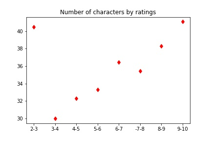

The plot shows that the number of characters in a movie is a good indicator of how well a movie will perform in the Internet Movie Database. Indeed, we can see that the more there are characters in the movie, the better the rating is. It is not a linear model but overall, the plot makes it clear. 

We can also see that movies whose rating is between 2 and 3 have a huge number of characters (almost as many as movies rated between 9 and 10). Hence, we can make an hypothesis: “bad-rated movies try to copy the success of masterpieces - very well rated movies”.

**The number of characters in a movie is correlated to its ratings.**

## Number of relations in a movie

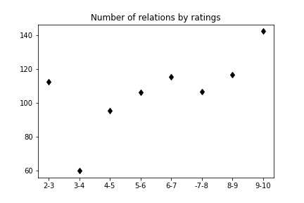

We can see that the pattern of the plot looks like the pattern of the previous one. It is normal: the more characters, the more relations between them. There is again the same rising function with a little decline for movies rated between 7 and 9, too small to make assumptions on it. 

As for our hypothesis, it is working again but it is a little less obvious.

**The number of relations in a movie is correlated to its ratings.**

## The betweenness centrality

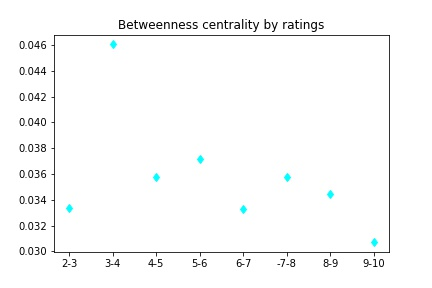

This is less obvious than before. We can see a small betweenness centrality in average is needed to obtain a good rating (between 6 and 10) but there are more fluctuations. For instance, movies rated between 4 and 5 have the same value of betweenness centrality as those rated between 7 and 8. 

However, our hypothesis seems to work again: the betweenness centrality of very bad movies (ratings between 2 and 3) has a very low betweenness centrality (the value is among the third lowest values).

**Betweenness centrality doesn’t provide clear results or clear correlation.**

## The closeness centrality

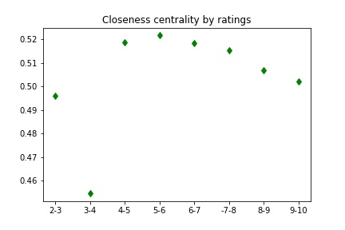

Closeness centrality is far more interesting than betweenness centrality. 

First of all, we don’t care about the value of the movie rated between 3 and 4 as it represents only one movie (not sufficient to make a generality).

If we skip this value, we can see that the lower the value of the closeness centrality, the better the rating. Besides, our hypothesis is right again! 

**The closeness centrality of a movie is correlated to its rating.**

## The eccentricity

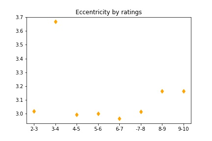

Again, it appears that eccentricity is a good way to know if a movie will have a good rating. We skip the value of the movie whose rating is between 3 and 4 and we can see that the pattern is clear:

The higher the eccentricity, the better the rating. However, it is not as linear as the other descriptors. It is obvious for movies between 8 and 9 but not for the others. Our hypothesis works less than usual but stays okay.

**The eccentricity of a movie is correlated to its rating, at least if its value is beyond 3.2, then it may be a good movie.**

## The degree

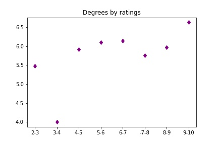

The degree of a movie seems to be a good descriptor as well. Its pattern looks very familiar to the ones of the number of relations and characters, even if it is not as obvious as the others. 

Nevertheless, we can say (not without doubt) that the higher the degree, the better the rating. Our hypothesis doesn’t work for the degree. It may tell us that in bad movies, there are lots of characters and lots of relationships in total, but each character is not connected to a lot of characters.

**The degree seems to be an okay correlator to a movie’s rating, but it is not sure.**

## The standard deviation of the descriptors

  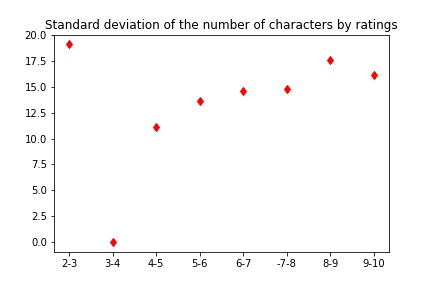
  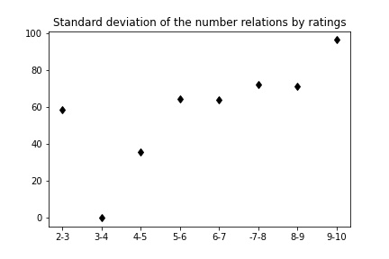 
  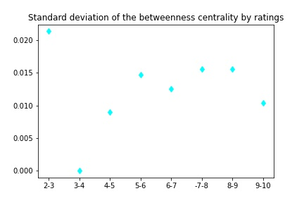

  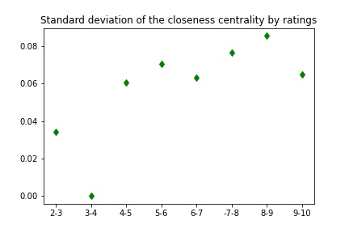
  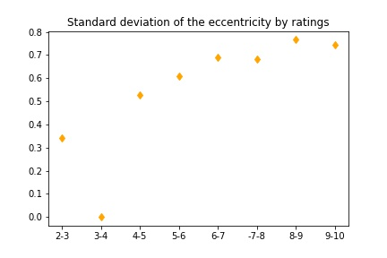 
  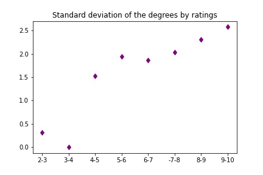

There is only one movie that has been rated between 3 and 4, thus the standard deviation is equal to zero for this range. 

As for the others, we can see that the main patterns of each descriptor are mainly the same as the previous ones. But the standard deviation is not interesting. 

# Discussion

## The dataset

The dataset is not perfect and there are not enough movies to make generalities. We can only make assumptions about the results we obtained. 

What would have been interesting is to work with a dataset of 500 movies rated between 2 and 3, 500 movies rated between 3 and 4, 500 movies rated between 4 and 5, 500 movies rated between 5 and 6, 1,000 movies rated between 6 and 7, 1,000 movies rated between 7 and 8, 500 movies rated between 8 and 9 and 500 movies rated between 9 and 10 since IMDb doesn’t have many movies whose rating is less than 2.

## The range

It would have been very interesting to extend the range of the ratings to a range of 0.5 or 0.25 instead of 1. We could have used this type for a range for movies rated between 6 and 10 to have clearer details about the correlation between ratings and movies’ social structure.

## The descriptors

We only captured six features among all the possible ones. We could investigate a little bit further by taking other features such as the modularity class.

# Conclusion

In conclusion, this research project studied the correlation between IMDb ratings and movies’ social structure. The results are clear: the number of characters and relations between them of a movie directly impact its rating (the higher, the better). The mean value of the closeness centrality of each character in a movie is a really good indicator of how well a movie will be rated (the lower, the better). Eccentricity and degree are fine descriptors and it seems that a similar correlation could have been found, but it is unclear due to the imperfection of the dataset which has been used. Finally, the betweenness centrality doesn’t provide any sign of correlation. 

**Overall, we can say without a doubt that there is such a correlation and that the movie industry knows about it. That is why there are movies trying to copy the social structure of good movies but fail most of the time.**

# References

[Moviegalaxies - Social Networks in Movies, Jermain Kaminski](https://dataverse.harvard.edu/dataset.xhtml;jsessionid=403e7d9dd70271a686ed8c4e1c8d?persistentId=doi%3A10.7910%2FDVN%2FT4HBA3&version=&q=&fileTypeGroupFacet=%22Archive%22&fileAccess=Public&fileSortField=size)
